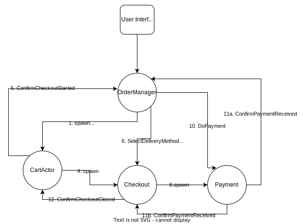

# Lab 3 - Akka Actor Testing

## Testing code in scala - ScalaTest

* As a testing framework, we will use [ScalaTest](https://www.scalatest.org/)
* ScalaTest offers different [styles of testing](https://www.scalatest.org/user_guide/selecting_a_style). In the repo examples, `WordSpecLike` style is used.

## Testing actors

For testing actors we can use [akka-actor-testkit-typed](https://doc.akka.io/docs/akka/current/typed/testing.html). Extending `ScalaTestWithActorTestKit` abstract class actor system for tests is created and all it's lifecycle is managed and cleaned up properly. We have two types of testing:

1. Synchronous testing on one thread, explained here: https://doc.akka.io/docs/akka/current/typed/testing-sync.html#synchronous-behavior-testing
2. Asynchronous testing - preffered as it more closely imitates real environment (uses real ActorSystem), explained here - https://doc.akka.io/docs/akka/current/typed/testing-async.html  

## How to run tests?

All tests are in `src/test/scala/myActorTest`. To run tests execute `sbt test`.

## Assignment

The template for Lab 3: https://github.com/agh-reactive/reactive-scala-labs-templates/tree/lab-3 
* **be sure that your local lab-3 branch is up to date with remote one**
* **remember about merging solution from lab 2 into this branch**

1. (20 points)

* Add to action system actors `OrderManager` and `Payment` according to the diagram below:

* Add test for `CartActor`. Tests should contain:
    * synchronous testing
    * asynchronous testing

2. (10 points) Using actor testkit implement tests for `Checkout` actor to assess the behavior presented below (in particular check if `Cart` actor receives `ConfirmCheckoutClosed` message from its child - `Checkout`)

3. (10 points) Change implementation to use in `OrderManager` the [Adapter Response](https://doc.akka.io/docs/akka/current/typed/interaction-patterns.html#adapted-response) pattern. Tip: actors (e.g. `Checkout`) should send responses in the form of events (e.g. `CheckoutClosed`), and the adapter should map them into commands (e.g. `ConfirmCheckoutClosed`).

## Submission

Use the following steps to submit your solution.

First, before implementing the solution:
1. Merge `lab2-solution -> master`
2. Merge `lab-3 -> master`  (resolve conflicts)

Next:
1. Create branch `lab3-solution` (from `master`)
2. Implement the assignments using `lab3-solution`
3. Create a PR `lab3-solution -> master`
4. Submit the link to the PR as a solution
